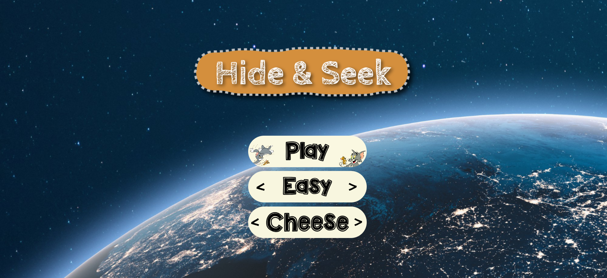

# Hide and Seek - Web Game



Welcome to Hide and Seek, a web game built using vanilla JavaScript. In this game you are challenged to find hidden gifts and avoid the dangerous bomb. Test your luck and play this simple and fun game.

## Features

- Simple and intuitive gameplay
- Multiple difficulty levels to choose from
- Various themes to customize the game environment
- Engaging sound effects for an immersive experience
- Interactive game interface with visual feedback
- Responsive design, suitable for different screen sizes

## Game levels

The game contains three levels :-

<table>
    <tr>
        <td>Game levels</td>
        <td>Boxes</td>
        <td>Gifts</td>
        <td>Bomb</td>
    </tr>
    <tr>
        <td>Easy</td>
        <td>9</td>
        <td>3</td>
        <td>1</td>
    </tr>
    <tr>
        <td>Normal</td>
        <td>16</td>
        <td>3</td>
        <td>1</td>
    </tr>
    <tr>
        <td>Hard</td>
        <td>25</td>
        <td>3</td>
        <td>1</td>
    </tr>
</table>

## Cheese Theme 🧀

In this theme you will be shown lot a cheese pieces and you have to find hidden Jerry behind them


## The Wedding Ring Theme 💍

In this theme the boxes are the wedding ring boxes you have to find the boxes which have rings in them


Theme idea credits : [Sindhura Pogarthi](https://github.com/SindhuraPogarthi)

## The Piggybank Theme 🐷

In this theme you will have to break the piggybanks and find out which of them have coins, beware the bomb


## Demo

Include a link to a live demo of the game, or provide screenshots showcasing the gameplay and interface.

```bash
https://www.hideandseekk.vercel.app
```

## Installation

1. Clone the repository:

```bash
git clone https://github.com/your-username/hide-and-seek-game.git
```

2. Open the game folder in your preferred code editor.

## Usage

1. Open the `index.html` file in a web browser.
2. Customize the game difficulty and theme settings.
3. Click on the "Play" button to start the game.
4. Click and find on the hidden gifts with best score possible.
5. Enjoy the game and try to achieve a high score!

## Contributing

Contributions are welcome! If you'd like to contribute to the game, follow these steps:

1. Fork the repository.
2. Create a new branch for your feature or bug fix.
3. Make your modifications and commit the changes.
4. Push your branch to your forked repository.
5. Open a pull request, describing the changes you made.

## Contact

For any inquiries or feedback, feel free to reach out to [Arpit Tyagi](https://www.linkedin.com/in/arpittyagirocks/).
